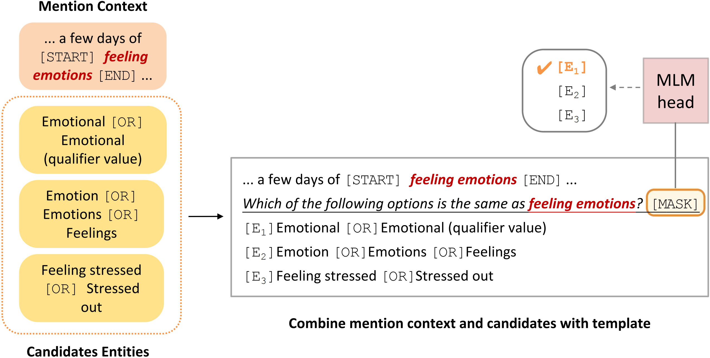

# Prompt-BioEL
<p align="center">
  
</p>

An entity re-ranking model based on **prompt tuning** for **biomedical entity linking**,
along with a KB-enhanced self-supervised pretraining strategy.
More details can be found in our paper
"Improving Biomedical Entity Linking with Cross-Entity Interaction" (accepted by [AAAI 2023](https://aaai-23.aaai.org/)).


## 🚨: Usage

### Environment
```
conda activate -n bioEL python=3.9
conda activate bioEL
pip install -r requirements.txt
```

### Data and Checkpoints
Please see the `README.md` files in different folders to download the corresponding data and checkpoints.

### Evaluate with Our Checkpoints
After downloading the data and checkpoints, you can use the command below to replicate our results reported in the paper.
If you want to train your own model, please skip to [preprocess data step](#Preprocess-Data).
- NCBI-Disease
```
bash eval_ncbi.sh
```
- BC5CDR
```
bash eval_bc5cdr.sh
```
- COMETA
```
bash eval_cometa.sh
```

### Preprocess Data


